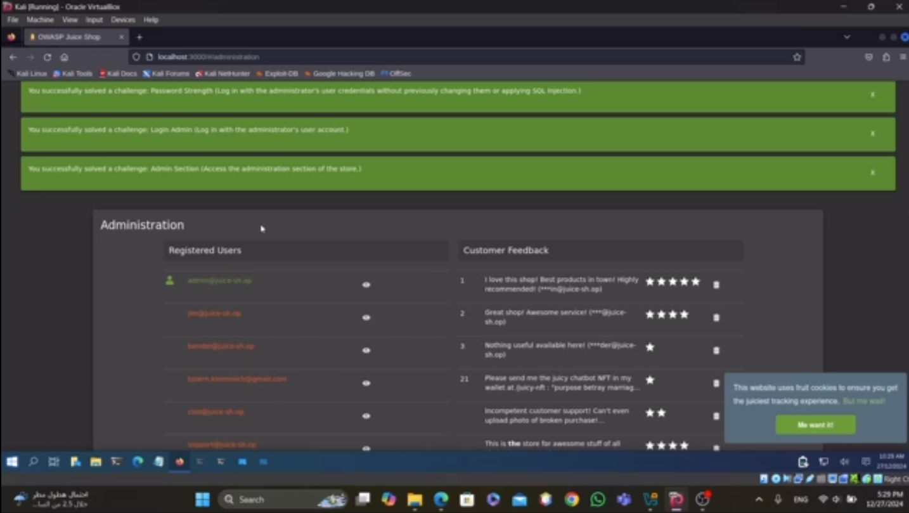

# Web Penetration Testing Report

## Executive Summary

### Purpose of the Test
The purpose of this penetration test was to identify and exploit vulnerabilities in the OWASP Juice Shop application. The goal was to simulate potential attack scenarios, understand their impacts, and recommend remediations to enhance the application's security.

### Key Findings
- **Critical Vulnerabilities Identified:**
  1. Vulnerable to enumeration attacks.
  2. Susceptible to brute-force attacks due to the absence of rate-limiting.
  3. Reflective XSS vulnerabilities in the product search feature.
  4. SQL injection vulnerabilities in application forms.

- **Impact:**  
  These vulnerabilities can lead to unauthorized administrative access, data theft, and exploitation of the application.

### Summary of Recommendations
- Implement rate-limiting and CAPTCHA mechanisms.
- Validate and sanitize user inputs to prevent XSS and SQL injection attacks.
- Restrict access to sensitive paths and randomize admin URLs.

---

## Scope and Methodology

### Scope
The scope of this test was the OWASP Juice Shop application, including:
- Websites
- APIs
- Application features exposed to users.

### Methodology
- **Approach:** Black-box testing, simulating the behavior of an external attacker with no prior knowledge of the application.
- **Tools Used:**
  - Burp Suite
  - ffuf

---

## Vulnerability Findings

### 1. Enumeration to Find Admin Path
**Description:**  
The application exposes hidden paths that attackers can discover by analyzing the URL structure or using enumeration tools like **ffuf**.

**Risk:**  
High. Discovery of the admin functionality can lead to further attacks like brute force or privilege escalation.

**Potential Impact:**  
An attacker may gain access to sensitive admin features and exploit them to compromise the application.

**Evidence:**  
- Example: Enumerating paths such as `/admin` using **ffuf** revealed the admin login page.
- 

**Remediation Steps:**  
- Restrict access to sensitive paths using authentication and authorization mechanisms.
- Implement security through obscurity by randomizing or hiding admin URLs.

---

### 2. Brute Force on Admin Credentials
**Description:**  
The admin login page lacks protections against brute-force attacks, enabling attackers to guess passwords using tools like **Burp Suite**.

**Risk:**  
Critical. This vulnerability allows unauthorized access to admin accounts, granting full control of the application.

**Potential Impact:**  
Compromise of administrative privileges can lead to data breaches, application misconfigurations, and more.

**Evidence:**  
- Using **Burp Suite**, we conducted a brute-force attack with the known email `admin@juice-sh.op`, which successfully cracked the password.
- 

**Remediation Steps:**  
- Implement rate-limiting and CAPTCHA mechanisms.
- Introduce account lockout policies after repeated failed login attempts.

---

### 3. XSS in Product Search
**Description:**  
The product search functionality reflects unsanitized user input, allowing attackers to inject malicious scripts.

**Risk:**  
High. This vulnerability allows attackers to execute arbitrary JavaScript in a victim's browser.

**Potential Impact:**  
The attacker can steal session cookies, redirect users, or perform phishing attacks.

**Evidence:**  
- Injecting `` in the search bar executed JavaScript in the browser.

**Remediation Steps:**  
- Use input validation and output encoding.
- Implement Content Security Policy (CSP) headers.

---

### 4. SQL Injection in User Input Forms
**Description:**  
Certain input forms are vulnerable to SQL injection, allowing attackers to manipulate SQL queries.

**Risk:**  
Critical. This vulnerability can lead to data exfiltration, unauthorized access, or complete database compromise.

**Potential Impact:**  
Attackers may view, modify, or delete sensitive data.

**Evidence:**  
- Entering `' OR 1=1 --` bypassed authentication on the login form.

**Remediation Steps:**  
- Use prepared statements with parameterized queries.
- Validate and sanitize all user inputs.

---

### 5. Insecure Direct Object Reference (IDOR) in Basket ID

**Description:**  
The application allows users to modify the `bid` (basket ID) in session storage. Changing this ID allows one user to view or modify another user's basket.

**Risk:**  
**High.** This vulnerability compromises data integrity and privacy by allowing unauthorized access to another user's data.

**Potential Impact:**  
- Attackers can view sensitive user information in the basket (e.g., items, quantities, prices).
- Attackers can manipulate the basket's contents, leading to potential fraud or disruption of service.

**Evidence:**  
- By modifying the `bid` value in session storage to another user's basket ID, the contents of that user's basket were displayed.
- 

**Remediation Steps:**  
1. Implement server-side authorization checks to ensure users can only access their own basket.
2. Avoid relying solely on client-side data for critical identifiers.
3. Use secure, non-guessable IDs (e.g., UUIDs) for resources.

---

## Exploitation and Attack Simulation

### Tools and Techniques Used
- **Tools:**  
  - Burp Suite  
  - ffuf  

- **Techniques:**  
  - Enumeration to identify hidden paths.  
  - Brute-forcing admin credentials.  
  - Injecting malicious scripts (XSS).  
  - Exploiting input validation vulnerabilities (SQL Injection).

### Outcome and Impact
The simulated attacks successfully demonstrated critical vulnerabilities that can lead to:
- Unauthorized administrative access.
- Data leakage.
- Compromise of user sessions.

---

## Conclusion

### Summary of Security Posture
The penetration test identified multiple critical vulnerabilities, highlighting a need for immediate security enhancements. The application's current security posture is weak, exposing it to various types of attacks.

### Overall Risk Level
**High.**  
The combination of authentication issues, input validation vulnerabilities, and lack of protective mechanisms results in a high overall risk.

### Next Steps for Remediation
1. Implement secure coding practices, such as input validation and parameterized queries.
2. Introduce rate-limiting and CAPTCHA to prevent brute-force attacks.
3. Conduct regular security assessments to ensure ongoing protection against emerging threats.

